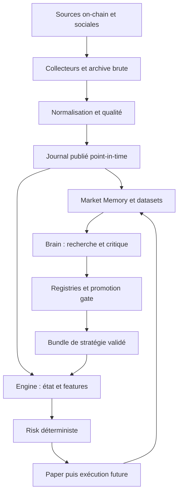

# ASTRA — Architecture V0

Baseline 2026-09-29. Source fonctionnelle : `docs/REQUIREMENTS.md` (copie intégrale du texte fourni). Les décisions sont définitives pour le périmètre V0 et révisables par ADR, pas une promesse d'architecture définitive pour plusieurs années.

## Audit du cahier des charges

| Point faible ou ambiguïté | Décision | Preuve requise |
|---|---|---|
| Quatre timestamps ne garantissent pas seuls le point-in-time | Publication persistée, lignage transitif et vues as-of ; toute correction est une nouvelle révision | Correction tardive invisible avant sa publication |
| Un historique récupéré maintenant ne décrit pas la connaissance passée d'ASTRA | Séparer replay réellement observé et simulation contrefactuelle avec hypothèses de disponibilité explicites | Manifest du dataset identifie le mode |
| Slot seul insuffisant ; `processed` peut appartenir à un fork | Identité blockhash + slot + instruction + finalité observée ; rétractions append-only | Replay d'un fork puis finalisation sans effacer le passé |
| Gagnants, wallets et KOL choisis après coup | Univers prospectif et cohortes gelées, incluant tokens disparus, échecs et sorties impossibles | Manifests d'univers horodatés |
| Confiance verbale LLM et quantité d'agents | Sorties structurées, evidence IDs et incertitude ; pas de vote majoritaire entre modèles | Aucun claim sans sources ; refus possible |
| Paper/shadow avant V4 peut devenir irréaliste | Définir protocole expérimental dès V0 ; V3 construit le simulateur ; V4 valide son utilisation scientifique | Aucun résultat V3 ne permet de promotion |
| PnL ne suffit pas à promouvoir | Gate de preuves, qualité, coûts stressés, stabilité, capacité et risques | Décision reproductible avec veto |
| "24/7" et "extrêmement rapide" non chiffrés | SLO proposés et protocole de benchmark ; valeurs non revendiquées | Mesures sur machine cible et feeds réels |
| Consensus entre fournisseurs peut masquer une divergence | Captures indépendantes, rapprochement explicite, désaccord mis en quarantaine | Test à deux sources divergentes |
| Graphe d'acteurs incertain | Une arête est une assertion temporelle avec evidence et alternative ; pas d'identité personnelle déduite du seul co-trading | Analyse de sensibilité aux clusters |

## Frontières et circulation

Brain : Python, tâches durables et budgets bornés. Son arrêt n'arrête pas un Engine déjà chargé avec un bundle valide. Le Brain ne signe aucune transaction, ne choisit pas une taille en temps réel et ne modifie pas directement les limites. Les agents sont des rôles spécialisés de workers ; neuf déploiements séparés ne sont pas nécessaires.

Engine V5 : candidat Rust, processus séparé. Decode -> state -> incremental features -> filters -> score -> hard risk -> sizing -> intent -> construction -> route -> confirmation -> reconciliation. Pas d'import Brain ni de réseau LLM. Le bundle comprend hash, version de schéma, features, paramètres, politique de risque, durée de validité et compatibilité. Activation atomique entre deux événements ; rollback vers un bundle compatible. Un bundle expiré ou un état incohérent bloque les nouvelles entrées. Les procédures de réduction du risque suivent une politique déterministe indépendante.

Pour V1 local, seul le journal de données est implémenté. Les scripts Python ne sont pas le Fast Engine et aucune latence de trading n'est revendiquée.

## Topologie progressive

V1a, livré : un processus offline, SQLite WAL/FULL, archive brute BLOB, normalisation et publication en transactions séparées, CLI de lecture/reprise/backup. Aucun service externe requis. C'est un adaptateur de référence pour prouver la sémantique, pas une base couvrant tout Solana.

V1b cible : collecteur -> objet brut durable -> metadata/outbox PostgreSQL -> normaliseur -> publication. L'ACK au fournisseur suit la durabilité. Un crash entre objet et transaction laisse un objet orphelin récupérable par inventaire ; jamais une ligne publiée pointant vers un objet non durable. Les captures sont groupées en segments avec index des offsets et checksums. Les unités de commit et manifeste sont explicites.

PostgreSQL est l'autorité des métadonnées/registries et des publications. Les octets bruts sont conservés en stockage objet à rétention configurée. ClickHouse et Parquet sont des projections analytiques reconstruisibles, ajoutées après mesure. Le graphe commence avec des tables d'arêtes dans PostgreSQL. Cache mémoire dans chaque worker ; Redis seulement si un besoin de coordination partagé est mesuré. NATS JetStream est un candidat de transport futur, jamais l'unique archive. Pas de Kubernetes en V1.

## SLO et exploitation cibles — non mesurés

Objectifs V1b : aucune perte silencieuse après ACK, RPO 0 pour crash d'un processus après commit local ; RPO de sinistre proposé 5 minutes avec réplication/backup externe ; RTO proposé 30 minutes après test de restauration. Soak test 72 h avant qualification V1 production, puis 7 jours avant V3 connecté. Ces objectifs dépendent de l'infrastructure, pas du code seul.

Mesurer feed lag, publication lag p50/p95/p99, slots manquants ou non résolus, doublons, conflits, backlog, erreurs, volume disque, coût par million de messages, taux de couverture des programmes et latence de reprise. Les slots sautés ne sont pas automatiquement des données manquantes. Health distingue liveness du processus, readiness des dépendances et qualité par dataset. Logs JSON avec trace_id, capture_id, provider, normalizer_version ; jamais de secret ou URL contenant un token.

Engine : mesurer decode-to-risk et send-to-confirm séparément, sous charge de 1x/5x/10x du trafic observé. Budget initial à examiner : p99 decode-to-risk < 5 ms sur machine dédiée. Il s'agit d'un objectif, non d'un benchmark existant. Réseau, fees et inclusion doivent être mesurés séparément.

## Modes de panne

| Panne | Comportement prévu | Niveau livré |
|---|---|---|
| Arrêt entre capture et normalisation | Reprise à partir du brut | Test local |
| Arrêt après normalisation avant publication | Publier à la reprise, jamais antidater | Test local |
| Doublons, conflit d'identité | Archive de chaque réception ; déduplication ou quarantaine | Test local |
| Retour d'horloge | Quarantaine à la normalisation ; arrêt publication | Test local |
| Feed absent ou divergent | Watermark dégradé, bloque stratégie dépendante, reconnexion/backfill | Spécifié |
| Fork | Rétraction versionnée, recompute état, interdiction nouvelles entrées concernées | Rétraction locale testée ; détection réseau à construire |
| Panne base/disque | Pas d'ACK ni publication ; backpressure puis arrêt contrôlé | Contrat ; injection disque à construire |
| Panne LLM | Recherche en attente ; Engine continue sous politique valide | Frontière conçue ; aucun Engine lancé |
| Échec/timeout transaction | État UNKNOWN ; vérifier signature avant toute nouvelle tentative | V6 à construire |
| Corruption | Hash/integrity check puis quarantaine/restauration | Hash checks locaux ; redondance distante à construire |

## Sécurité et permissions

Collecteurs read-only ; normaliseur sans clés ; Brain accès borné aux datasets ; registry gate seul publie un bundle ; Engine autorisé seulement pour des intents validés ; signer séparé en V6 avec allowlists, plafonds, TTL, kill switch et audit. Aucun wallet requis avant V6. Les contenus sociaux et sorties LLM sont des données non fiables : interdiction d'exécuter du code/outillage sur instruction incluse dans ces données. Sorties validées contre schéma, quotas de tokens/coûts/temps, provenance et cache versionné.

Pas de choix de modèle OpenAI ni d'appel API dans V0/V1a. `LLMProvider` déclare des capacités ; le futur adaptateur doit vérifier la documentation officielle et les modèles réellement accessibles au compte au moment de son installation. Un modèle indisponible produit une erreur de capacité explicite, jamais une substitution silencieuse.
